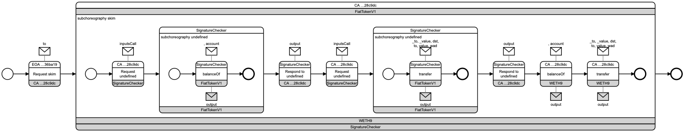

# ocelchor

Reference implementation accompanying the paper:

> Richard Hobeck, Alessandro Marcelletti, Andrea Morichetta, Ingo Weber.
> *Representing BPMN Choreographies in OCEL 2.0.*

This repository provides a pipeline for:
- Representing BPMN 2.0 process choreographies as OCEL 2.0 event logs from
  two source domains: Ethereum transaction traces and XES collaborative
  event logs (Corradini et al. 2024).
- Checking well-formedness of the representations based on 17 constraints (C0–C16).
- Converting the event log representation of individual choreographies
  encoded in OCEL 2.0 as BPMN files.
- Discovering one generalised BPMN 2.0 choreography model per OCEL 2.0
  event log, pooling all instances of the log.

---

## Repository layout

```
ocelchor/
├── trace2ocelchor/        Convert Ethereum transaction traces → OCEL 2.0
├── xescol2ocelchor/       Convert XES collaborative event logs → OCEL 2.0
├── ocelchorvalidator/     Validate OCEL 2.0 logs against constraints C0–C16
├── ocelchormodel/         Create BPMN choreography models from OCEL 2.0 logs
│                          (one model per choreography instance)
├── ocelchormodel_RAD/     Discover generalised BPMN choreography models from
│                          OCEL 2.0 logs (one model per event log)
├── generate_unique_xes.py Standalone script: deduplicate XES traces by
│                          choreography variant (requires pm4py)
├── generate_fig4.py       Standalone script for reproducing Figure 4
│                          (requires pm4py)
├── evaluate_conformance.py Standalone script: log-level trace-variant
│                          agreement vs Peña _chor.xes (requires pm4py)
└── src/ocelchor/          Unified CLI dispatcher (blockchain workflow)
```

Each tool has its own `README.md`, `tests/`, and `data/` directory.

---

## Requirements

- Python ≥ 3.10
- [uv](https://docs.astral.sh/uv/)

---

## Installation

Clone the repository and install all tools in one step:

```bash
git clone <repository-url>
cd ocelchor
uv sync
```

This installs the `ocelchor` unified CLI as well as the five individual tool CLIs.

---

## Pipeline

The tools form a pipeline with two source-domain entry points sharing the
domain-independent validator, per-instance converter, and per-log discovery:


### Step 1 — Convert source data to OCEL 2.0

**Blockchain side.** Input traces are in `trace2ocelchor/data/input_unique/`
(the deduplicated evaluation family; the full ≈3 GB trace family is not
committed — see the [trace2ocelchor README](trace2ocelchor/README.md)).
Pre-computed OCEL 2.0 logs are mirrored in the downstream tools'
`data/input/` directories (e.g. `ocelchorvalidator/data/input/`).

```bash
uv run ocelchor convert trace2ocelchor/data/input_unique/ -o log.ocel.json
```

**XES side.** Original Corradini et al. logs are in
`xescol2ocelchor/data/input/`; deduplicated counterparts (one representative
trace per choreography variant) are in `xescol2ocelchor/data/input_unique/`;
the resulting OCEL 2.0 logs are in `xescol2ocelchor/data/output/`.

```bash
cd xescol2ocelchor
uv run xescol2ocelchor data/input_unique/collectivelog_*_uniqueInteraction.xes -o data/output/
```

See [Regenerating the deduplicated XES data](#regenerating-the-deduplicated-xes-data)
below for the pm4py-based dedup script that produces `data/input_unique/`.

### Step 2 — Validate the log

```bash
uv run ocelchor validate log.ocel.json
```

The `ocelchorvalidator/data/input/` directory mirrors both source domains'
OCEL outputs, so running

```bash
cd ocelchorvalidator && uv run ocelchorvalidator data/input/*.json
```

reproduces the constraint-validation results reported under
[Evaluation results](#evaluation-results).

### Step 3 — Create BPMN choreography models (one per choreography instance)

Pre-computed BPMN files are in `ocelchormodel/data/output/`.

```bash
uv run ocelchor mine log.ocel.json -o output/
```

BPMN files written to `output/` can be opened in the Live Version of
[chor-js](https://github.com/bptlab/chor-js-demo).

One example of many — the choreography model of a single Uniswap
`UniswapV2Pair (USDC-WETH)` transaction
([`ocelchormodel/data/output/0xb4e16d0168e52d35cacd2c6185b44281ec28c9dc_uniqueFunction/0x26234c96164c54b64dd49886400ce1de8f199ff21c06620ef51acb18b380398e.bpmn`](ocelchormodel/data/output/0xb4e16d0168e52d35cacd2c6185b44281ec28c9dc_uniqueFunction/0x26234c96164c54b64dd49886400ce1de8f199ff21c06620ef51acb18b380398e.bpmn)),
rendered:



### Step 4 — Discover a generalised choreography model (one per event log)

Where Step 3 renders each observed instance, `ocelchormodel_RAD` pools all
instances of a log into a single generalised model with roles as
participant bands. Pre-computed discovered models are in
`ocelchormodel_RAD/data/output/` (per log: BPMN model, process tree,
diagnostics D1–D13).

```bash
uv run ocelchormodel-rad ocelchormodel_RAD/data/input/*.json -o output/
```

See the [ocelchormodel_RAD README](ocelchormodel_RAD/README.md) for the
discovery approach, typing rules, and diagnostics.

---

## Individual CLIs

Each tool is also available as a standalone command:

| Command                    | Tool              |
|----------------------------|-------------------|
| `uv run trace2ocelchor`    | trace2ocelchor    |
| `uv run xescol2ocelchor`   | xescol2ocelchor   |
| `uv run ocelchorvalidator` | ocelchorvalidator |
| `uv run ocelchormodel`     | ocelchormodel     |
| `uv run ocelchormodel-rad` | ocelchormodel_RAD |

Run any command with `--help` for the full list of options. The unified
`ocelchor` dispatcher currently routes `convert` to `trace2ocelchor`; for
the XES side, invoke `xescol2ocelchor` directly.

---

## Running tests

Each tool has its own test suite. From the repository root:

```bash
cd trace2ocelchor    && uv run pytest && cd ..
cd xescol2ocelchor   && uv run pytest && cd ..
cd ocelchorvalidator && uv run pytest && cd ..
cd ocelchormodel     && uv run pytest && cd ..
uv run --project ocelchormodel_RAD python -m pytest ocelchormodel_RAD/tests
```

---

## Evaluation results

The tables below show the dataset characteristics and constraint validation
results for the 19 datasets used in the evaluation:

- **12 blockchain logs** — Ethereum transaction traces processed by
  `trace2ocelchor`.
- **7 XES collaborative event logs** — from Corradini et al. (2024) [^1],
  processed by `xescol2ocelchor` (figures reported here come from the
  unique-trace deduplicated pipeline run).

Column names follow the paper's notation.

[^1]: Corradini, F., Pettinari, S., Re, B., Rossi, L., Tiezzi, F.
  *A technique for discovering BPMN collaboration diagrams.* Software and
  Systems Modeling 23(6), 1323–1343 (2024). Data:
  <https://bitbucket.org/proslabteam/colliery_validation/>.

**Dataset characteristics**

| Dataset | #vars | #e | #m | #parts | #scoping | #E2O | #O2O | #E2O[m] | #E2O[cb] | #O2O[c] |
|---------|------:|---:|---:|-------:|---------:|-----:|-----:|--------:|---------:|--------:|
| **Consensus Layer: DepositContract**<br>`0x00000000219ab540356cbb839cbe05303d7705fa` | 1 | 9 | 17 | 3 | 1 | 53 | 34 | 17 | 9 | 0 |
| **ENS: ENSGovernor**<br>`0x323a76393544d5ecca80cd6ef2a560c6a395b7e3` | 9 | 21 | 31 | 8 | 6 | 111 | 63 | 31 | 17 | 1 |
| **Tornado.Cash: GovernanceProposalStateUpgrade**<br>`0x5efda50f22d34f262c29268506c5fa42cb56a1ce` | 11 | 35 | 47 | 16 | 17 | 187 | 100 | 47 | 35 | 6 |
| **Tornado.Cash: TornadoRouter**<br>`0xd90e2f925da726b50c4ed8d0fb90ad053324f31b` | 2 | 85 | 146 | 22 | 13 | 486 | 303 | 146 | 85 | 11 |
| **PancakeSwap: MasterChefV3**<br>`0x556b9306565093c855aea9ae92a594704c2cd59e` | 13 | 241 | 361 | 45 | 64 | 1322 | 776 | 361 | 238 | 54 |
| **Uniswap: UniswapV2Pair (USDC-WETH)**<br>`0xb4e16d0168e52d35cacd2c6185b44281ec28c9dc` | 6 | 61 | 88 | 16 | 17 | 329 | 190 | 88 | 58 | 14 |
| **SushiSwap: Router**<br>`0xd9e1ce17f2641f24ae83637ab66a2cca9c378b9f` | 19 | 267 | 415 | 55 | 67 | 1481 | 880 | 415 | 265 | 50 |
| **CryptoKitties: Core (KittyCore)**<br>`0x06012c8cf97bead5deae237070f9587f8e7a266d` | 22 | 204 | 302 | 78 | 59 | 1113 | 646 | 302 | 199 | 42 |
| **CryptoKitties: SaleClockAuction**<br>`0xb1690c08e213a35ed9bab7b318de14420fb57d8c` | 2 | 6 | 10 | 4 | 2 | 34 | 20 | 10 | 6 | 0 |
| **Yuga Labs: BoredApeYachtClub**<br>`0xbc4ca0eda7647a8ab7c2061c2e118a18a936f13d` | 9 | 18 | 21 | 13 | 5 | 86 | 45 | 21 | 11 | 3 |
| **Nouns DAO: NounsToken**<br>`0x9c8ff314c9bc7f6e59a9d9225fb22946427edc03` | 7 | 12 | 13 | 11 | 3 | 55 | 28 | 13 | 6 | 2 |
| **Beanstalk Farms: Attack data**<br>`beanstalk_attack_ocel.json` | 3 | 489 | 703 | 58 | 139 | 2658 | 1541 | 703 | 489 | 136 |
| **Real1: Two-robot search**<br>`collectivelog_real1_uniqueInteraction.xes` |  1 |   2 |   2 |  2 |   0 |     8 |     4 |   2 |   0 |   0 |
| **Real2: Travel booking**<br>`collectivelog_real2_uniqueInteraction.xes` | 96 | 842 | 480 |  2 |   0 |  3368 |   960 | 842 |   0 |   0 |
| **Real3: Smart thermostat**<br>`collectivelog_real3_uniqueInteraction.xes` | 59 | 472 | 321 |  3 |   0 |  1880 |   634 | 472 |   0 |   0 |
| **Real4: ZooClub registration**<br>`collectivelog_real4_uniqueInteraction.xes` |  1 |   4 |   4 |  3 |   0 |    16 |     8 |   4 |   0 |   0 |
| **Real5: Academic paper review**<br>`collectivelog_real5_uniqueInteraction.xes` |  3 |  15 |  15 |  3 |   0 |    60 |    30 |  15 |   0 |   0 |
| **Healthcare: Hospitalization**<br>`collectivelog_healthcare_uniqueInteraction.xes` | 17 | 116 | 116 |  4 |   0 |   455 |   223 | 116 |   0 |   0 |
| **Smart agriculture: Tractor coordination**<br>`collectivelog_smartagriculture_uniqueInteraction.xes` | 10 | 114 | 100 |  3 |   0 |   452 |   206 | 114 |   0 |   0 |

**Constraint validation results** (format: `violations / checked`)

| Dataset |   C0 |   C1 |   C2 |   C3 |     C4 |   C5 |   C6 |   C7 |   C8 |   C9 |  C10 |  C11 |  C12 |  C13 |  C14 |    C15 |   C16 |
|---------|-----:|-----:|-----:|-----:|-------:|-----:|-----:|-----:|-----:|-----:|-----:|-----:|-----:|-----:|-----:|-------:|------:|
| **Consensus Layer: DepositContract**<br>`0x00000000219ab540356cbb839cbe05303d7705fa` | 0/9  | 0/17 | 0/9  | 0/9  |   0/9  | 0/17 | 0/17 | 0/9  | 0/9  | 0/17 | 0/17 | 0/9  | 0/1  | 0/1  | 0/1  |   0/8  |  0/1  |
| **ENS: ENSGovernor**<br>`0x323a76393544d5ecca80cd6ef2a560c6a395b7e3` | 0/21 | 0/31 | 0/21 | 0/21 |   0/21 | 0/31 | 0/31 | 0/21 | 0/21 | 0/31 | 0/31 | 0/21 | 0/6  | 0/6  | 0/6  |  0/12  |  0/6  |
| **Tornado.Cash: GovernanceProposalStateUpgrade**<br>`0x5efda50f22d34f262c29268506c5fa42cb56a1ce` | 0/35 | 0/47 | 0/35 | 0/35 |   0/35 | 0/47 | 0/47 | 0/35 | 0/35 | 0/47 | 0/47 | 0/35 | 0/17 | 0/17 | 0/17 |  0/24  | 0/17  |
| **Tornado.Cash: TornadoRouter**<br>`0xd90e2f925da726b50c4ed8d0fb90ad053324f31b` | 0/85 | 0/146| 0/85 | 0/85 |   0/85 | 0/146| 0/146| 0/85 | 0/85 | 0/146 | 0/146 | 0/85 | 0/13 | 0/13 | 0/13 |  0/83  | 0/13  |
| **PancakeSwap: MasterChefV3**<br>`0x556b9306565093c855aea9ae92a594704c2cd59e` | 0/241| 0/361| 0/241| 0/241| 10/241 | 0/361| 0/361| 0/241| 0/241| 0/361 | 0/361 | 0/241| 0/64 | 0/64 | 0/64 |  0/228 | 0/64  |
| **Uniswap: UniswapV2Pair (USDC-WETH)**<br>`0xb4e16d0168e52d35cacd2c6185b44281ec28c9dc` | 0/61 | 0/88 | 0/61 | 0/61 |   0/61 | 0/88 | 0/88 | 0/61 | 0/61 | 0/88 | 0/88 | 0/61 | 0/17 | 0/17 | 0/17 |  0/55  | 0/17  |
| **SushiSwap: Router**<br>`0xd9e1ce17f2641f24ae83637ab66a2cca9c378b9f` | 0/267| 0/415| 0/267| 0/267|  0/267 | 0/415| 0/415| 0/267| 0/267| 0/415 | 0/415 | 0/267| 0/67 | 0/67 | 0/67 |  0/248 | 0/67  |
| **CryptoKitties: Core (KittyCore)**<br>`0x06012c8cf97bead5deae237070f9587f8e7a266d` | 0/204| 0/302| 0/204| 0/204|  2/204 | 0/302| 0/302| 0/204| 0/204| 0/302 | 0/302 | 0/204| 0/59 | 0/59 | 0/59 |  0/182 | 0/59  |
| **CryptoKitties: SaleClockAuction**<br>`0xb1690c08e213a35ed9bab7b318de14420fb57d8c` | 0/6  | 0/10 | 0/6  | 0/6  |   0/6  | 0/10 | 0/10 | 0/6  | 0/6  | 0/10 | 0/10 | 0/6  | 0/2  | 0/2  | 0/2  |  0/4   |  0/2  |
| **Yuga Labs: BoredApeYachtClub**<br>`0xbc4ca0eda7647a8ab7c2061c2e118a18a936f13d` | 0/18 | 0/21 | 0/18 | 0/18 |   0/18 | 0/21 | 0/21 | 0/18 | 0/18 | 0/21 | 0/21 | 0/18 | 0/5  | 0/5  | 0/5  |  0/9   |  0/5  |
| **Nouns DAO: NounsToken**<br>`0x9c8ff314c9bc7f6e59a9d9225fb22946427edc03` | 0/12 | 0/13 | 0/12 | 0/12 |   0/12 | 0/13 | 0/13 | 0/12 | 0/12 | 0/13 | 0/13 | 0/12 | 0/3  | 0/3  | 0/3  |  0/5   |  0/3  |
| **Beanstalk Farms: Attack data**<br>`beanstalk_attack_ocel.json` | 0/489| 0/703| 0/489| **1**/489|  0/489 | 0/703| **1**/703| 0/489| 0/489| 0/703 | 0/703 | 0/489| 0/139| 0/139| 0/139|  1/486 | 0/139 |
| **Real1: Two-robot search**<br>`collectivelog_real1_uniqueInteraction.xes` |  0/2  |  0/2  |  0/2  |   0/2  |   0/2  |  0/2  |   0/2  |  0/2  |  0/2  | 0/2 | 0/2 |  0/2  | 0/0 | 0/0 | 0/0 |  0/1   | 0/0 |
| **Real2: Travel booking**<br>`collectivelog_real2_uniqueInteraction.xes` | 0/842 | 0/842 | 0/842 |  0/842 |  0/842 | 0/842 |  0/842 | 0/842 | 0/842 | 0/842 | 0/842 | 0/842 | 0/0 | 0/0 | 0/0 |  0/746 | 0/0 |
| **Real3: Smart thermostat**<br>`collectivelog_real3_uniqueInteraction.xes` | 0/472 | 0/472 | 0/472 |  **8**/472 |  0/472 | 0/472 |  **8**/472 | 0/472 | 0/472 | 0/472 | 0/472 | 0/472 | 0/0 | 0/0 | 0/0 | **99**/413 | 0/0 |
| **Real4: ZooClub registration**<br>`collectivelog_real4_uniqueInteraction.xes` |  0/4  |  0/4  |  0/4  |   0/4  |   0/4  |  0/4  |   0/4  |  0/4  |  0/4  | 0/4 | 0/4 |  0/4  | 0/0 | 0/0 | 0/0 |  0/3   | 0/0 |
| **Real5: Academic paper review**<br>`collectivelog_real5_uniqueInteraction.xes` |  0/15 |  0/15 |  0/15 |   0/15 |   0/15 |  0/15 |   0/15 |  0/15 |  0/15 | 0/15 | 0/15 |  0/15 | 0/0 | 0/0 | 0/0 |  0/12  | 0/0 |
| **Healthcare: Hospitalization**<br>`collectivelog_healthcare_uniqueInteraction.xes` | 0/116 | 0/116 | 0/116 |  **9**/116 |  0/116 | 0/116 |  **9**/116 | 0/116 | 0/116 | 0/116 | 0/116 | 0/116 | 0/0 | 0/0 | 0/0 |  **9**/99 | 0/0 |
| **Smart agriculture: Tractor coordination**<br>`collectivelog_smartagriculture_uniqueInteraction.xes` | 0/114 | 0/114 | 0/114 | **28**/114 |  0/114 | 0/114 | **28**/114 | 0/114 | 0/114 | 0/114 | 0/114 | 0/114 | 0/0 | 0/0 | 0/0 |  **9**/104 | 0/0 |

The violations and their causes are discussed in the paper's evaluation
section.

### Trace-variant agreement against Peña's `_chor.xes`

The script `evaluate_conformance.py` at the repository root quantifies how
much of the choreography behaviour our OCEL representation preserves by
comparing trace-variant sets against Peña et al.'s [^2] independently
created `_chor.xes` choreography logs. It produces the paper claim:

[^2]: Peña, L., Andrade, D., Delgado, A., Calegari, D.
  *Inter-organizational collaborative BPMN 2.0 business process discovery.*
  J. Intelligent Information Systems (2024).

> *For the Corradini et al. data, our extracted choreography control-flows
> show the same trace variants as Peña et al.'s independently created XES
> choreography logs on **7/7** datasets.*

Requires [pm4py](https://pm4py.fit.fraunhofer.de/):

```bash
uv run --with pm4py python evaluate_conformance.py
```

Inputs (third-party Peña reference data) and outputs (regenerable script
artefacts) live under `eval_artifacts/` — see `eval_artifacts/README.md`
for the input/output layout.

#### A note on the supplementary alignment-based conformance numbers

The script also computes alignment-based conformance against Peña et al.'s
*discovered* BPMN choreography models and prints those numbers under a
"Supplementary analysis (not in paper)" block. We **did not** include them
in the paper. 
**The fit numbers are low and need explaining.** Most non-conformance
occurs because of two reasons: 
  1. Peña's discovered models are not sufficiently general to allow all observed behavior (even in their own XES logs). Trace variation that our OCEL 2.0 event logs and their XES event logs show is not preserved in their models (e.g., real2 has 96 distinct trace variants in our log that all collapse onto a single canonical model path), and 
  2. Peña's real3 model mixes two execution cycles that are independent in the data and the normative collaboration model (see [Real3 normative process model](xescol2ocelchor/data/normative%20BPMN%20files%20%28from%20Corradini%20et%20al.%202024%29/Real3.bpmn)), misrepresenting the actually observed behavior in the data.

Both findings are presentable and explainable, even good arguments for future work and better choreography miners. But space in the paper was limited.
The supplementary numbers are still printed by the script for transparency.

---

## Reproducing Figure 4

Figure 4 is produced by the standalone script `generate_fig4.py`, which requires
[pm4py](https://pm4py.fit.fraunhofer.de/). Install it and run:

```bash
pip install pm4py
python generate_fig4.py
```

---

## Regenerating the deduplicated XES data

The seven deduplicated XES logs in `xescol2ocelchor/data/input_unique/` are
produced from the original Corradini et al. logs in
`xescol2ocelchor/data/input/` by the standalone script
`generate_unique_xes.py`, which requires
[pm4py](https://pm4py.fit.fraunhofer.de/):

```bash
uv run --with pm4py python generate_unique_xes.py
```

The deduplicated logs are then converted to OCEL via `xescol2ocelchor`:

```bash
cd xescol2ocelchor
uv run xescol2ocelchor data/input_unique/collectivelog_*_uniqueInteraction.xes -o data/output/
```

The resulting OCEL files in `xescol2ocelchor/data/output/` are the source of
truth for the XES OCEL files; the validator's and modeler's `data/input/`
directories hold copies.

---

## License

MIT — see [LICENSE](LICENSE).


## GenAI assistance disclosure
The implementation of this repository was developed in collaboration with
[Claude Code](https://claude.ai/code) (Anthropic).

